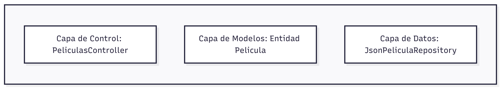
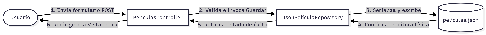
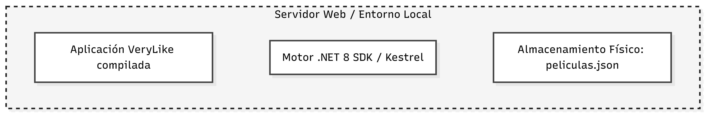

# ADR-02: Definición de las Vistas Arquitectónicas de VeryLike

| Campo | Valor |
|-------|-------|
| Autor | Venus Getsemaní Semino Alemán |
| Fecha | 05/06/2026 |
| Estado| `Aceptado` |

---

## Contexto
El sistema *VeryLike* requiere formalizar su estructura técnica para cumplir con los estándares de mantenibilidad y escalabilidad del curso de Arquitectura de Software. Esta decisión busca documentar la configuración del proyecto bajo el patrón MVC, asegurando que el equipo de desarrollo comprenda la separación entre la lógica, la interfaz y la persistencia de datos en formato JSON.

---

## 1. Vista Lógica
Describe los módulos funcionales del sistema.



* **Responsabilidades:**
    * **PeliculasController:** Gestiona el flujo de peticiones HTTP y la interacción con el usuario.
    * **Pelicula (Modelo):** Define la estructura de datos del dominio.
    * **IRepository:** Interfaz que desacopla la lógica de negocio de la capa de persistencia.
    * **JsonPeliculaRepository:** Implementación concreta que serializa/deserializa archivos JSON.

## 2. Vista de Desarrollo (Física)
Muestra la organización del código fuente en el sistema de archivos.

```text
VeryLike/
├── Controllers/
│   └── PeliculasController.cs    <-- Lógica de control
├── Data/
│   ├── IRepository.cs           <-- Interfaz de abstracción
│   └── JsonPeliculaRepository.cs <-- Implementación persistencia JSON
├── Models/
│   └── Pelicula.cs              <-- Modelo de datos
├── Views/
│   └── Peliculas/Index.cshtml   <-- Interfaz de usuario
└── wwwroot/data/
    └── peliculas.json           <-- Almacenamiento físico de datos
```

## 3. Vista de Procesos
Representa el flujo y la interacción dinámica de la operación: **Guardar una película en la lista**.



## 4. Vista de Despliegue
Describe el entorno de ejecución necesario donde operará el sistema.


