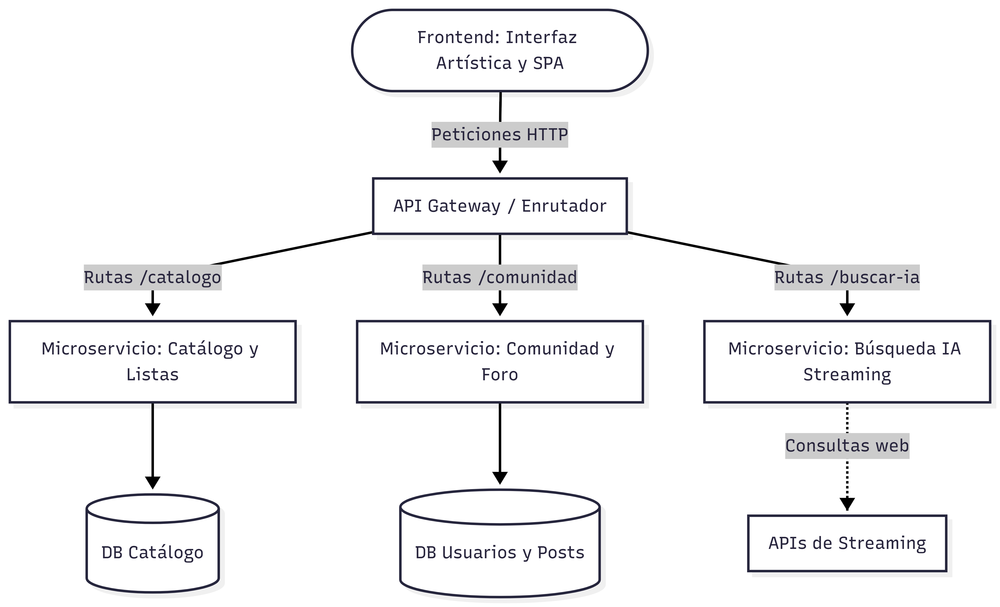

# ADR-03: Definición del Estilo Arquitectónico de VeryLike

| Campo | Valor |
|-------|-------|
| Autor | Venus Getsemaní Semino Alemán |
| Estado| `Aceptado` |

## Contexto

VeryLike está evolucionando de un proyecto escolar a una plataforma web robusta a larga escala. La visión actual integra múltiples dominios con necesidades técnicas muy distintas:
1. **Catálogo dinámico:** Un registro estándar de películas/series (con datos como estudio, sinopsis, duración, etc.) y un catálogo exclusivo que crece según el historial del usuario.
2. **Motor de Inteligencia Artificial:** Un sistema que busca automáticamente en qué plataforma de streaming se encuentra el contenido para redirigir al usuario.
3. **Comunidad y Foro:** Un espacio con un enfoque artístico (tipo blog) donde los usuarios interactúan, hacen amigos, comparten fotos y otorgan calificaciones detalladas (del 1 al 5 con comentarios).

Esta evolución requiere una arquitectura que soporte alta concurrencia en el foro, procesamiento intensivo para la IA y transacciones rápidas para el catálogo, sin que un módulo afecte el rendimiento del otro.

---

## Decisión

En esta fase de escalabilidad, decidí evolucionar el sistema hacia una **Arquitectura Basada en Microservicios**, complementada con un modelo **Cliente-Servidor**.

### ¿Por qué?

Elegí esta opción porque resuelve el problema de la asimetría de recursos. El foro requiere muchísimas operaciones de lectura/escritura simultáneas (alta interacción social), mientras que la IA necesita poder de cómputo para buscar plataformas en tiempo real. 
Al separar el sistema en microservicios independientes, garantizo que un pico de tráfico en la comunidad no colapse la capacidad del usuario para ver su catálogo. Además, el modelo Cliente-Servidor me permite aislar el Frontend (la vista visual y artística del foro) del Backend, abriendo la puerta a desarrollar una interfaz muy moderna e interactiva sin depender de la carga del servidor.

### Alternativas consideradas

| Alternativa | Por qué la descarté |
|-------------|---------------------|
| **Monolito en Capas (N-Tier extendido)** | Tener el catálogo, el foro de alta interacción y el procesamiento de IA en un solo servidor crearía un cuello de botella severo. Si la IA consume mucha memoria, toda la página (incluyendo el foro) se volvería lenta, rompiendo la experiencia del usuario. |
| **Serverless (Funciones como Servicio)** | Se evaluó para reducir costos, pero se descartó porque los tiempos de "arranque en frío" (*cold starts*) afectarían negativamente la experiencia en tiempo real necesaria para el foro comunitario y el chat entre amigos. |
| **Arquitectura Orientada a Eventos (Pura)** | Añadiría una complejidad innecesaria para las operaciones de registro básico del catálogo de películas. Aunque es útil para notificaciones, basar todo el sistema en eventos oscurecería el flujo de datos principal. |

---

## Consecuencias

**Lo que gano:**

- **Una consecuencia técnica:** Escalabilidad independiente. Si la función de "Comunidad/Foro" se vuelve muy popular, puedo asignarle más servidores y memoria exclusivamente a ese microservicio, sin gastar recursos extra en el microservicio del catálogo.
- **Una consecuencia sobre el proceso o el equipo:** Desarrollo en paralelo. Al usar Cliente-Servidor, puedo trabajar en la estética artística y visual del Frontend sin importar si la lógica de la IA en el Backend todavía se está programando, siempre y cuando conecten mediante una API.

**Lo que sacrifico o asumo:**

- **Una limitación técnica:** Aumenta considerablemente la complejidad operativa. En lugar de manejar un solo proyecto y un solo archivo JSON o base de datos, ahora tendré que gestionar la comunicación entre varios servicios, un API Gateway y múltiples bases de datos.
- **Una deuda o riesgo:** Mantener la consistencia de los datos. Por ejemplo, si un usuario cambia su foto de perfil en el microservicio del Foro, tendré que asegurar que ese cambio también se refleje en el microservicio del Catálogo, lo cual es más complejo que tener todo en una sola base de datos.

## Diagrama

---
## Uso de IA:

En este proyecto se está implementando el uso de IA para darle una esstructura más profeciomal acercandolo más a un poryecto en el ámbito laboral, se implementó para aclarar duda o corregir ideas mal planteadas.

---
