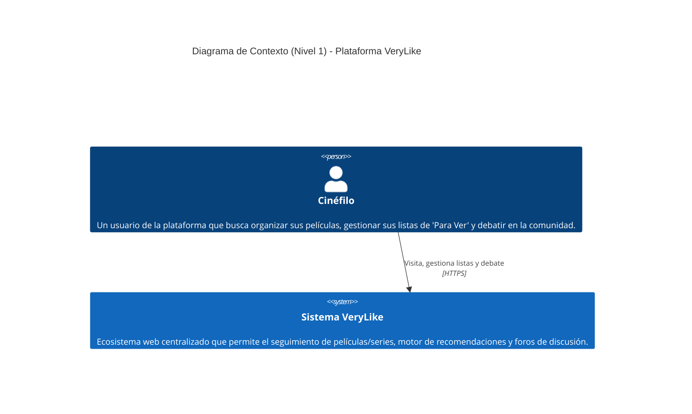
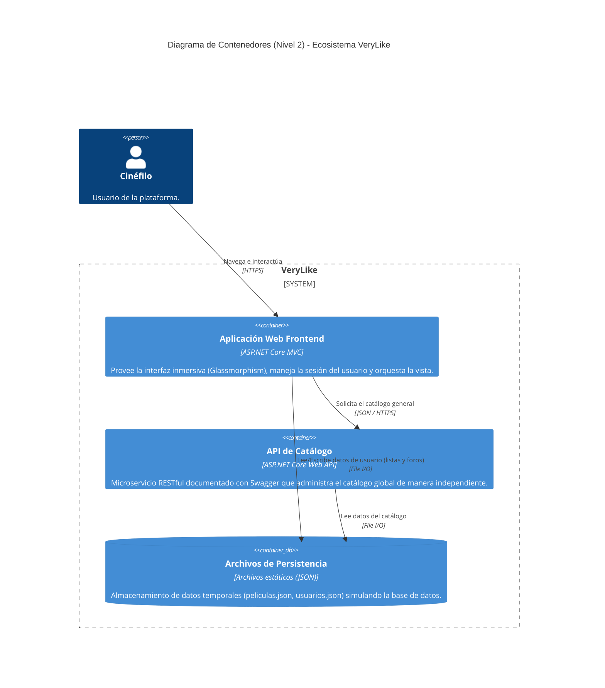
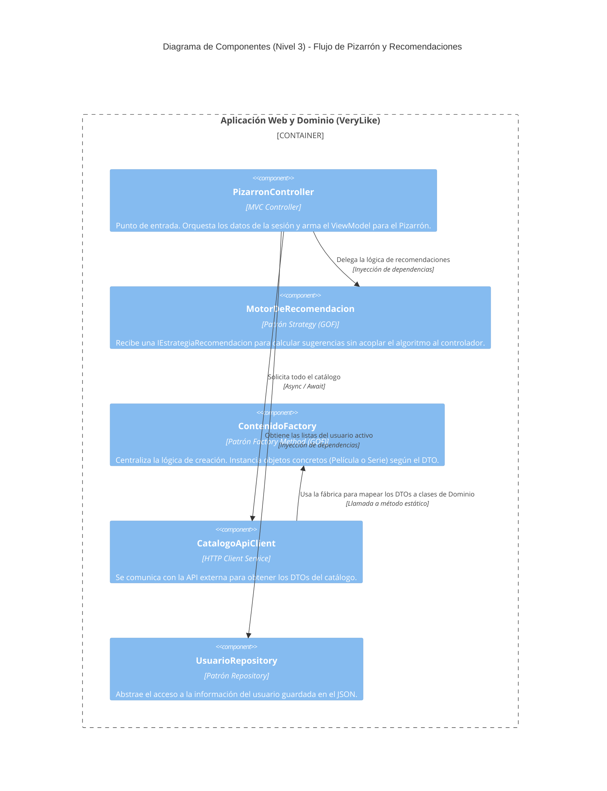

# ADR-05: Adopción de Patrones de Diseño GOF (Factory Method y Strategy)

| Campo | Valor |
|--------|--------|
| **Autor** | Venus Semino |
| **Fecha** | 22 de julio de 2026 |
| **Estado** | `Aceptado` |

## Contexto

Tras la separación del catálogo en VeryLike.Catalog.API (ADR-04), la lógica de dominio quedó concentrada en VeryLike.Domain. Sin embargo, dos problemas de diseño seguían latentes:

Instanciación rígida de contenido audiovisual. El catálogo mezcla dos tipos de contenido — Pelicula y Serie — que comparten la mayoría de sus atributos (Nombre, Género, Año, Sinopsis, Studio, Calificación) pero difieren en uno específico (Duracion vs. Temporadas). Antes de esta iteración, cualquier clase que leyera catalogo.json necesitaba conocer ambos tipos concretos y decidir manualmente cuál instanciar, repitiendo esa lógica de decisión en cada lugar que tocara el archivo.

Lógica de recomendación atada al controlador. El PizarronController necesitaba mostrar una lista de contenido "recomendado", pero el criterio de recomendación (mejor calificado, por género, más reciente, y eventualmente un criterio basado en IA) es una regla de negocio que cambia con el tiempo. Si ese criterio se escribe directamente dentro del controlador, cada nuevo criterio implica modificar una clase que no debería conocer el detalle del algoritmo.

---

## Diagramas Arquitectónicos C4

A continuación se documenta la arquitectura de VeryLike utilizando el modelo C4 para reflejar la separación en microservicios y la adopción de patrones GOF.

---

### Nivel 1: Contexto (Context)

> **Nota Breve:**
> * **Para quién es:** Personas de negocio, directivos y usuarios no técnicos.
> * **Qué pregunta responde:** ¿Cuál es el panorama general del proyecto, qué es la plataforma en términos simples y quién interactúa con ella?




### Nivel 2: Contenedores (Containers)

> * **Para quién es:** Arquitectos de Software, DevOps y Líderes Técnicos.
> * **Qué pregunta responde:** ¿Cuáles son las piezas de software grandes (desplegables) que forman el sistema y cómo se comunican entre sí a alto nivel?



---


### Nivel 3: Componentes (Components)

> * **Para quién es:** Desarrolladores de Software del equipo.
> * **Qué pregunta responde:** ¿Cómo está estructurado el código internamente dentro de la aplicación, qué patrones de diseño GOF se utilizan y cómo se relacionan las clases?




## Patrón 1: Factory Method

### Problema que Resuelve

`CatalogoRepository` necesita convertir cada objeto plano del JSON (`CatalogoItemDto`) en una instancia de `Pelicula` o `Serie`. Sin este patrón, ese `if/switch` viviría dentro del repositorio (o se duplicaría en cualquier otra clase que leyera el catálogo), mezclando responsabilidades de *acceso a datos* con responsabilidades de *construcción de objetos*.

### Funcionamiento

`ContenidoFactory.Crear(CatalogoItemDto dto)` lee el campo discriminador `Tipo` del DTO y decide qué subclase de `ContenidoAudiovisual` instanciar:

```csharp
ContenidoAudiovisual contenido = dto.Tipo.Trim().ToLowerInvariant() switch
{
    "serie"     => new Serie     { Temporadas = dto.Temporadas ?? 0 },
    "pelicula"  => new Pelicula  { Duracion   = dto.Duracion   ?? string.Empty },
    _ => throw new InvalidOperationException($"Tipo de contenido desconocido: '{dto.Tipo}'.")
};
```

`CatalogoRepository` (la clase cliente) solo invoca `ContenidoFactory.CrearTodos(dtos)` y trabaja siempre contra el tipo base `ContenidoAudiovisual`; nunca necesita saber cómo se decide entre `Pelicula` y `Serie`.

### Alternativas Consideradas

**Deserialización polimórfica nativa de System.Text.Json** (`[JsonPolymorphic]` / `[JsonDerivedType]`).
*Razón de rechazo:* acopla el modelo de dominio a atributos específicos de serialización y dificulta agregar lógica de validación o valores por defecto durante la construcción. El Factory Method mantiene esa lógica explícita y fácil de leer en un solo lugar.

**Un `if/else` dentro de cada repositorio que necesite el catálogo.**
*Razón de rechazo:* es exactamente la duplicación que el patrón busca evitar; cualquier nuevo tipo de contenido (por ejemplo, "Documental") obligaría a tocar múltiples archivos en lugar de uno solo.

---

## Patrón 2: Strategy

### Problema que Resuelve

El criterio para decidir qué se muestra en la sección "Recomendadas" del Pizarrón es una regla de negocio que va a evolucionar (hoy es "mejor calificadas", a futuro puede ser "por género preferido" o un modelo de IA). Si esa lógica vive directamente en `PizarronController`, cada cambio de criterio implica modificar el controlador y arriesga romper la lógica de sesión y de armado del `ViewModel` que también vive ahí.

### Funcionamiento

`IEstrategiaRecomendacion` define el contrato común para cualquier algoritmo de recomendación:

```csharp
public interface IEstrategiaRecomendacion
{
    List<ContenidoAudiovisual> AplicarEstrategia(List<ContenidoAudiovisual> catalogo);
}
```

`OrdenarPorCalificacionStrategy` es la primera implementación concreta (ordena de mayor a menor calificación). `MotorDeRecomendacion` actúa como el *contexto* del patrón: recibe una estrategia en su constructor y delega en ella sin conocer su lógica interna:

```csharp
var motor = new MotorDeRecomendacion(new OrdenarPorCalificacionStrategy());
modelo.Recomendadas = motor.Recomendar(catalogo.ToList())
    .Where(c => !paraVerIds.Contains(c.Id))
    .Take(10)
    .ToList();
```

`PizarronController` solo conoce `IEstrategiaRecomendacion` y `MotorDeRecomendacion`; agregar una estrategia nueva (por género, por estudio, o una que consuma un modelo de IA) no requiere modificar el controlador, solo escribir una clase nueva que implemente la interfaz.

### Alternativas Consideradas

**Métodos de extensión LINQ directamente en el controlador** (`catalogo.OrderByDescending(...)`).
*Razón de rechazo:* funciona para un solo criterio fijo, pero no permite intercambiar el algoritmo en tiempo de ejecución ni probar cada criterio de forma aislada (por ejemplo, en pruebas unitarias).

**Enum + switch para seleccionar el criterio.**
*Razón de rechazo:* sigue concentrando todos los algoritmos en una sola clase y obliga a modificar ese switch cada vez que se agrega un criterio nuevo, violando el principio de abierto/cerrado que Strategy sí respeta.

---

## Consecuencias

### Positivas

- La construcción de `Pelicula`/`Serie` está centralizada en un único punto (`ContenidoFactory`), reduciendo el riesgo de lógica duplicada o inconsistente.
- Agregar un nuevo tipo de contenido audiovisual o un nuevo criterio de recomendación ya no implica modificar clases existentes, solo agregar una nueva (principio abierto/cerrado).
- `PizarronController` queda enfocado en orquestar la petición HTTP, no en decidir algoritmos de negocio.
- Ambos patrones dejan el terreno preparado para el requerimiento original del proyecto: sustituir la estrategia actual por una que use IA, sin tocar el resto del sistema.

### Negativas

- Se agregan clases e interfaces adicionales (`CatalogoItemDto`, `IEstrategiaRecomendacion`, `MotorDeRecomendacion`) que incrementan ligeramente la cantidad de archivos del proyecto.
- Por ahora solo existe una estrategia concreta (`OrdenarPorCalificacionStrategy`); el beneficio completo del patrón Strategy se hará evidente cuando se agregue una segunda estrategia real.

---

## Deudas Técnicas

### Deuda Técnica #1: Infraestructura y Configuración Hardcodeada
### Descripción
Las URLs de comunicación entre microservicios (por ejemplo, `http://localhost:5000/api/peliculasapi`) y diversas rutas de archivos físicos se encuentran escritas directamente en el código fuente de los controladores del Frontend, como `PeliculasController` y `CatalogoApiClient`.

### Motivo
Esta decisión permitió acelerar la integración entre el Frontend y la nueva API REST durante el desarrollo local, evitando inicialmente una configuración más avanzada del contenedor de dependencias.

### Impacto
- La aplicación no es portable a ambientes de producción.
- El despliegue en servicios como AWS o Azure fallaría al intentar conectarse a `localhost`.
- Cada cambio de entorno (Desarrollo, QA o Producción) requeriría modificar y recompilar el código fuente.

### Propuesta de Refactorización
Aplicar el **Options Pattern** de .NET para extraer todas las URLs y cadenas de conexión hacia `appsettings.json` y variables de entorno.

Posteriormente, configurar un **Typed HttpClient** mediante `AddHttpClient()` para que la URL base sea inyectada dinámicamente según el entorno donde se ejecute la aplicación.


## Deuda Técnica #2: Persistencia mediante I/O Síncrono y Bloqueos (Locks)

### Descripción
Actualmente el almacenamiento y recuperación de datos (Catálogo, Usuarios y Foro) se realiza mediante archivos `.json` locales. Para evitar conflictos de escritura, clases como `MensajeForoRepository` utilizan bloqueos (`lock`) en memoria.

### Motivo
Se adoptó esta solución como una estrategia temporal que permitiera validar la arquitectura basada en los patrones **Factory**, **Strategy** y **Repository** sin invertir tiempo en configurar un ORM y diseñar una base de datos relacional.

### Impacto
- Impide la escalabilidad horizontal.
- Los bloqueos reducen el rendimiento cuando múltiples usuarios realizan operaciones simultáneamente.
- En una arquitectura distribuida, cada instancia tendría su propio archivo `.json`, provocando inconsistencias y pérdida de integridad de los datos.

### Propuesta de Refactorización
Migrar la persistencia hacia una base de datos relacional como **PostgreSQL** o **SQL Server** utilizando **Entity Framework Core**.

Gracias al uso previo del **Patrón Repositorio**, la migración únicamente requerirá crear nuevas implementaciones (por ejemplo, `SqlCatalogoRepository`) y modificar la inyección de dependencias en `Program.cs`, sin afectar la lógica de negocio ni los controladores existentes.

---

---

## Pruebas Automatizadas y Pipeline CI

### Estrategia de Pruebas (xUnit)
Para garantizar la calidad del software y evitar regresiones, se implementó una suite de pruebas unitarias utilizando **xUnit** bajo el patrón **AAA (Arrange-Act-Assert)**. 

### Clases Probadas
Se seleccionaron tres clases de la capa de Dominio (`VeryLike.Domain`) por contener lógica de negocio crítica y pura, sin dependencias externas:
1. **ContenidoFactory:** Se probó para asegurar que la fábrica instancia correctamente objetos `Pelicula` o `Serie` según las propiedades del DTO extraído.
2. **OrdenarPorCalificacionStrategy:** Se validó para garantizar que la regla de negocio de ordenamiento matemático funcione de manera exacta y aislada.
3. **MotorDeRecomendacion:** Se verificó para confirmar que el contexto del patrón Strategy recibe, inyecta y delega la responsabilidad correctamente a la estrategia activa.

### Pipeline de Integración Continua (GitHub Actions)
Se configuró un flujo de CI automatizado mediante **GitHub Actions** (`.github/workflows/ci.yml`). Este pipeline se ejecuta en cada `push` o `pull_request`, encargándose de restaurar dependencias, compilar el proyecto y correr toda la suite de pruebas automatizadas. Esto asegura como compuerta de calidad que ningún cambio nuevo rompa la arquitectura previamente validada.

---

## Uso de Inteligencia Artificial
En este proyecto se realizó con la ayuda de IA para poder resolver problemas de mal compilamiento, ajustar las variables e aydar con la parte lógica de los temas recientes aprendidos
